# CodeReview AI: Intelligent Code Review Pipeline with LangGraph Orchestration

## Objective

The objective of this project is to build an AI-powered automated code review system that empowers Development Teams and Engineering Managers to make informed code quality decisions. The solution combines static analysis tools (PyLint for code quality assessment), test coverage analysis (pytest-cov for coverage evaluation), and Generative AI modules (Gemini 2.0 Flash for intelligent code review) with comprehensive workflow orchestration using LangGraph. By seamlessly integrating multi-tool analysis with natural language explanations, the platform helps development teams deliver consistent, thorough, and actionable code reviews with automated approval/escalation mechanisms.

## Problem Statement

Code review is a critical but time-intensive process that creates bottlenecks in development workflows. Teams face challenges with **manual review bottlenecks**, **inconsistent standards**, and **limited analysis depth** for security vulnerabilities and performance optimization. As teams scale, the code review workload increases exponentially, making it difficult to maintain quality without sacrificing development velocity.

## Solution Overview

Build a unified AI-powered code review platform that combines static analysis (PyLint), test coverage evaluation (pytest-cov), and AI-powered recommendations (Gemini 2.0 Flash)—integrated seamlessly through **LangGraph multi-agent orchestration**. The platform enables **conditional decision-making**, orchestrates **specialized agent workflows**, and sends **automated email notifications** throughout the review process, ensuring consistent quality standards while reducing manual review overhead.

## Technical Limitations

**Language Support**: Currently limited to Python files (.py) - JavaScript, Java, C++ support requires additional static analyzers and coverage tools.

**Static Analysis Scope**: PyLint-focused analysis may miss domain-specific issues that specialized tools (SonarQube, CodeQL, Bandit) would detect.

**AI Model Dependency**: Relies on Gemini 2.0 Flash API availability, rate limits, and potential service interruptions.

**Platform Integration**: GitHub-specific implementation - GitLab, Bitbucket, Azure DevOps require separate API integrations.

**Coverage Analysis**: pytest-cov specific - other testing frameworks (Jest, JUnit, MSTest) need additional adapters.

**Scalability Constraints**: Current architecture handles single PR analysis - enterprise-scale batch processing requires distributed computing infrastructure.

## Visualization Requirements

Since this is a **graph-based application** using LangGraph, comprehensive visualization capabilities are essential:

**Real-time Workflow Visualization**: Interactive LangGraph execution flow with live node status indicators, showing agent progress and completion states.

**Multi-Agent Dashboard**: Visual representation of parallel agent execution with real-time status updates, completion timelines, and result summaries.

**Decision Tree Visualization**: Interactive display of conditional branching logic, threshold evaluations, and routing decisions throughout the workflow.

**Analysis Results Dashboard**: Visual charts and graphs showing PyLint scores, coverage metrics, AI confidence trends, and security vulnerability distributions.

**Email Notification Timeline**: Visual tracking of multi-stage notification delivery with timestamps and recipient confirmation.

**Historical Analytics**: Trend analysis dashboards showing code quality metrics over time, agent performance statistics, and workflow efficiency metrics.

**Agent Coordination Visualization**: Network graphs showing agent dependencies, data flow between agents, and coordination patterns in the multi-agent system.

## File Structure

```
code-review-pipeline/
├── main.py                    # CLI application entry point
├── config.py                  # Configuration settings and API keys
├── requirements.txt           # Python dependencies
├── review_workflow.py         # LangGraph workflow orchestration
├── workflow_nodes.py          # Individual workflow processing nodes
├── review_state.py            # State management and tracking
├── github_service.py          # GitHub API integration
├── pylint_service.py          # Static code analysis with PyLint
├── coverage_service.py        # Test coverage analysis
├── gemini_service.py          # AI-powered code review
├── email_service.py           # Email notification system
└── tests.py                   # Test suite for validation
```

**Core Data Flow:**
- **GitHub Integration**: Pull request details, changed files, and content extraction
- **Static Analysis**: PyLint code quality scoring and issue detection
- **Coverage Analysis**: Test coverage percentage and missing test identification
- **AI Review**: Gemini 2.0 Flash intelligent analysis with structured recommendations
- **Decision Engine**: Automated approval/escalation based on quality thresholds
- **Notification System**: Multi-stage email updates throughout the review process

## Tasks

### Core Implementation Tasks:

1. **Implement LangGraph Workflow Orchestration** (`review_workflow.py`)
   - Design 5-node workflow with conditional routing
   - Implement state management across workflow stages
   - Add error handling and recovery mechanisms

2. **Build Workflow Processing Nodes** (`workflow_nodes.py`)
   - PR Detector: GitHub API integration for pull request analysis
   - Code Analyzer: PyLint and coverage analysis execution
   - AI Reviewer: Gemini 2.0 Flash integration for intelligent review
   - Decision Maker: Quality threshold evaluation and routing logic
   - Report Generator: Comprehensive report generation and email dispatch

3. **Develop Service Integrations**:
   - **GitHub Service** (`github_service.py`): API integration, PR analysis, file extraction
   - **PyLint Service** (`pylint_service.py`): Static analysis execution and result parsing
   - **Coverage Service** (`coverage_service.py`): Test coverage analysis and gap identification
   - **Gemini Service** (`gemini_service.py`): AI-powered code review with structured output
   - **Email Service** (`email_service.py`): Multi-stage notification system

4. **Wire Everything in main.py** to support multiple execution modes:
   - GitHub PR review mode
   - Local file analysis mode
   - Interactive selection mode
   - Demo scenario execution

## Conditional Branching Architecture

The system demonstrates **sophisticated conditional branching** at multiple decision points throughout the LangGraph workflow:

### **1. PR Detection Branching**
```python
if pr_details_valid and files_found:
    route_to → [Security Agent, Quality Agent, Coverage Agent, AI Agent, Documentation Agent]
else:
    route_to → Error Handler
```

### **2. Parallel Agent Coordination**
```python
if all_agents_completed(["security", "quality", "coverage", "ai_review", "documentation"]):
    route_to → Agent Coordinator
else:
    route_to → Wait for remaining agents
```

### **3. Multi-Dimensional Decision Making**
```python
if security_score < 8.0 or high_severity_vulnerabilities > 0:
    route_to → Critical Escalation
elif pylint_score < 7.0 or coverage < 80% or ai_confidence < 0.8:
    route_to → Human Review Required
elif documentation_coverage < 70%:
    route_to → Documentation Review
else:
    route_to → Auto-Approve
```

### **4. Error Handling Branching**
```python
if workflow_error_occurred:
    route_to → Error Handler → Email Notification → END
else:
    route_to → Continue Normal Flow
```

### **5. Report Generation Routing**
```python
if critical_issues_found:
    generate → Escalation Report + Critical Alert Email
else:
    generate → Approval Report + Success Email
```

## Workflow Architecture

### **Parallel Multi-Agent Architecture Visualization**

```mermaid
graph TD
    START([🚀 Start]) --> PR[🔍 PR Detector]
    PR --> PARALLEL{"🎯 Launch Parallel Agents"}
    
    PARALLEL --> SEC[🔒 Security Agent]
    PARALLEL --> QUAL[📊 Quality Agent]
    PARALLEL --> COV[🧪 Coverage Agent]
    PARALLEL --> AI[🤖 AI Agent]
    PARALLEL --> DOC[📚 Documentation Agent]
    
    SEC --> COORD[🎯 Coordinator]
    QUAL --> COORD
    COV --> COORD
    AI --> COORD
    DOC --> COORD
    
    COORD --> DECISION{"⚖️ Decision Maker"}
    
    DECISION --> |"Security Issues"| CRITICAL[🚨 Critical Escalation]
    DECISION --> |"Quality Issues"| HUMAN[👥 Human Review]
    DECISION --> |"All Good"| APPROVE[✅ Auto-Approve]
    
    CRITICAL --> REPORT[📧 Report Generator]
    HUMAN --> REPORT
    APPROVE --> REPORT
    
    REPORT --> END([End])
    
    classDef agentNode fill:#e1f5fe,stroke:#01579b,stroke-width:2px,color:#000000
    classDef criticalNode fill:#ffebee,stroke:#c62828,stroke-width:3px,color:#000000
    classDef approveNode fill:#e8f5e8,stroke:#2e7d32,stroke-width:2px,color:#000000
    classDef defaultNode fill:#f9f9f9,stroke:#333333,stroke-width:2px,color:#000000
    
    class SEC,QUAL,COV,AI,DOC agentNode
    class CRITICAL criticalNode
    class APPROVE approveNode
    class START,PR,PARALLEL,COORD,DECISION,REPORT,END defaultNode
```



### LangGraph Multi-Agent Pipeline:

#### 1. **PR Detector Node** (`pr_detector_node`)
**Purpose:** Fetch and validate pull request details from GitHub API
**Inputs:** Repository URL, PR number
**Outputs:** PR metadata, changed Python files, file contents
**Key Functions:**
- `get_pr_details(repo_owner, repo_name, pr_number)` → PR metadata extraction
- `get_pr_files(repo_owner, repo_name, pr_number)` → Changed file identification
- `get_file_content(repo_owner, repo_name, file_path)` → File content retrieval

#### 2. **Parallel Specialized Agents** (Execute Simultaneously)

**Security Analysis Agent** (`security_analysis_agent`)
- **Purpose:** Dedicated security vulnerability detection
- **Capabilities:** Code injection detection, hardcoded credentials, shell injection, unsafe deserialization
- **Output:** Security score (0-10), vulnerability list with severity classification

**Quality Analysis Agent** (`quality_analysis_agent`)
- **Purpose:** Enhanced code quality assessment with PyLint + custom metrics
- **Capabilities:** Static analysis, complexity metrics, maintainability index, technical debt assessment
- **Output:** Quality scores, complexity analysis, refactoring recommendations

**Coverage Analysis Agent** (`coverage_analysis_agent`)
- **Purpose:** Comprehensive test coverage evaluation
- **Capabilities:** pytest-cov integration, missing test identification, test quality assessment
- **Output:** Coverage metrics, test gap analysis, testability scoring

**AI Review Agent** (`ai_review_agent`)
- **Purpose:** Intelligent code review with multi-agent context awareness
- **Capabilities:** Gemini 2.0 Flash integration, cross-agent correlation, security-aware recommendations
- **Output:** AI scores, improvement suggestions, contextual recommendations

**Documentation Agent** (`documentation_agent`)
- **Purpose:** Documentation quality and coverage analysis
- **Capabilities:** Docstring coverage, API documentation analysis, missing documentation identification
- **Output:** Documentation coverage metrics, improvement suggestions

#### 3. **Agent Coordinator** (`agent_coordinator`)
**Purpose:** Aggregate and coordinate all parallel agent results
**Inputs:** Results from all 5 specialized agents
**Outputs:** Unified analysis report, coordinated recommendations
**Key Functions:**
- `generate_multi_agent_pr_summary()` → Comprehensive PR analysis
- Cross-agent correlation and result aggregation

#### 4. **Decision Maker** (`decision_maker_node`)
**Purpose:** Evaluate quality thresholds and determine next actions
**Inputs:** All analysis results and quality scores
**Outputs:** Approval/escalation decision with reasoning
**Key Functions:**
- `determine_critical_issues(pylint_results, coverage_results, ai_reviews)` → Threshold evaluation
- Quality thresholds: PyLint ≥ 7.0/10, Coverage ≥ 80%, AI Confidence ≥ 0.8

#### 5. **Report Generator** (`report_generator_node`)
**Purpose:** Generate comprehensive reports and send notifications
**Inputs:** Complete analysis bundle and decision results
**Outputs:** Final report, email notifications
**Key Functions:**
- `format_final_report(pr_summary, pylint_results, coverage_results, ai_reviews)` → Report formatting
- `send_final_report_email(pr_details, final_report, is_critical)` → Email dispatch

### State Management System (`review_state.py`)

**Core Functions:**
1. `create_review_state(repo_owner, repo_name, pr_number)` → Initialize review tracking
   - Generate unique review ID
   - Set initial workflow stage
   - Initialize data containers

2. `update_stage(state, new_stage)` → Progress tracking
   - Update current workflow stage
   - Add timestamp for stage transition
   - Maintain audit trail

3. `add_email_sent(state, email_type)` → Notification tracking
   - Log email dispatch events
   - Track notification types and timestamps
   - Enable communication audit

## AI Integration Architecture

### Gemini 2.0 Flash Integration (`gemini_service.py`)

**Core AI Functions:**

1. **`review_code_with_ai(file_content, filename, pylint_results, coverage_results)`**
   - **Purpose:** Generate structured code review analysis
   - **Input:** Code content with context from static analysis
   - **Output:** Structured review with scores and recommendations
   - **Return Format:**
     ```python
     {
         "filename": str,
         "overall_score": float,  # 0.0-1.0
         "confidence": float,     # 0.0-1.0
         "strengths": List[str],
         "issues": List[str],
         "recommendations": List[str],
         "refactoring_suggestions": List[str],
         "security_concerns": List[str]
     }
     ```

2. **`generate_pr_summary(pr_details, pylint_results, coverage_results, ai_reviews)`**
   - **Purpose:** Create comprehensive PR-level analysis summary
   - **Input:** Aggregated analysis results from all files
   - **Output:** High-level recommendations and action items
   - **Return Format:**
     ```python
     {
         "recommendation": str,    # APPROVE/NEEDS_WORK/REJECT
         "priority": str,          # HIGH/MEDIUM/LOW
         "key_findings": List[str],
         "action_items": List[str],
         "approval_criteria": List[str]
     }
     ```

3. **`determine_critical_issues(pylint_results, coverage_results, ai_reviews)`**
   - **Purpose:** Evaluate if human review is required
   - **Input:** All analysis results and quality thresholds
   - **Output:** Boolean decision with detailed reasoning
   - **Logic:** Check PyLint score, coverage percentage, and AI confidence against thresholds

## Email Notification System (`email_service.py`)

### 4-Stage Email Pipeline:

1. **Review Started** (`send_review_started_email`)
   - Notification: PR analysis initiated
   - Content: PR details, file count, expected timeline

2. **Analysis Complete** (`send_analysis_complete_email`)
   - Notification: Static analysis and coverage results
   - Content: PyLint scores, coverage percentages, issue summaries

3. **AI Review Complete** (`send_ai_review_complete_email`)
   - Notification: AI analysis finished
   - Content: AI scores, key recommendations, identified issues

4. **Final Report** (`send_final_report_email`)
   - Notification: Complete review with decision
   - Content: Comprehensive analysis, approval/escalation decision, action items

### Email Content Formatting:

**`format_ai_reviews_summary(ai_reviews)`** → AI analysis summary for email
**`format_final_report(pr_summary, pylint_results, coverage_results, ai_reviews)`** → Complete review report

## Usage Modes and CLI Interface

### 1. **GitHub PR Review Mode**
```bash
python main.py --pr https://github.com/user/repo 123
```
- Analyzes specific pull request
- Full workflow execution with email notifications
- Automated decision-making and reporting

### 2. **Local File Analysis Mode**
```bash
python main.py --files src/main.py src/utils.py tests/test_main.py
```
- Analyzes local Python files
- Simplified workflow without GitHub integration
- Direct console output with analysis results

### 3. **Interactive Mode**
```bash
python main.py
```
- Menu-driven interface for mode selection
- User-guided PR or file selection
- Step-by-step workflow execution

### 4. **Demo Mode**
```bash
python main.py demo
```
- Sample code analysis demonstration
- Pre-configured scenarios for testing
- Educational workflow walkthrough

## Quality Thresholds and Decision Logic

### Enhanced Quality Gates (`config.py`):
```python
PYLINT_THRESHOLD = 7.0          # Minimum code quality score (0-10)
COVERAGE_THRESHOLD = 80.0       # Minimum test coverage percentage
AI_CONFIDENCE_THRESHOLD = 0.8   # Minimum AI analysis confidence
SECURITY_THRESHOLD = 8.0        # Minimum security score (0-10) - NEW
DOCUMENTATION_THRESHOLD = 70.0  # Minimum documentation coverage - NEW
```

### Enhanced Decision Matrix:
- **Auto-Approve:** All thresholds met (PyLint ≥7.0, Coverage ≥80%, AI ≥0.8, Security ≥8.0, Documentation ≥70%)
- **Documentation Review:** Documentation coverage < 70% but other thresholds met
- **Human Review Required:** Any quality threshold failed (PyLint, Coverage, AI Confidence)
- **Critical Escalation:** Security score < 8.0 or high-severity vulnerabilities detected
- **Immediate Escalation:** Critical security vulnerabilities (eval(), exec(), shell injection) found

## Expected Inputs

### GitHub Integration:
- **Repository URL:** GitHub repository for PR analysis
- **PR Number:** Specific pull request identifier
- **GitHub Token:** API authentication for repository access

### Configuration Files:
- **API Keys:** Gemini API key for AI analysis
- **Email Settings:** SMTP configuration for notifications
- **Quality Thresholds:** Customizable quality gates

### Local File Analysis:
- **Python Files:** Local .py files for analysis
- **Project Structure:** Directory structure for context

## Expected Outputs

### Analysis Results:
- **PyLint Scores:** Code quality assessment (0-10 scale)
- **Coverage Reports:** Test coverage percentages and gap analysis
- **AI Reviews:** Structured recommendations and improvement suggestions
- **Decision Reports:** Approval/escalation decisions with reasoning

### Notifications:
- **Email Updates:** Multi-stage workflow notifications
- **Console Output:** Real-time progress and results
- **Error Reports:** Comprehensive error handling and reporting

### Workflow Artifacts:
- **Review State:** Complete workflow execution tracking
- **Analysis Summaries:** Formatted reports for stakeholders
- **Action Items:** Specific recommendations for code improvement

## Implementation Explanation

### Prerequisites:
1. **Install Dependencies:** `pip install -r requirements.txt`
2. **Configure API Keys:** Set up GitHub token and Gemini API key in `config.py`
3. **Email Setup:** Configure SMTP settings for notifications

### Execution Steps:
1. **Navigate to Project Directory:** `cd code-review-pipeline`
2. **Run Analysis:** Execute desired mode using CLI commands
3. **Monitor Progress:** Track workflow execution through console output and emails
4. **Review Results:** Analyze generated reports and recommendations

### Testing:
- **Unit Tests:** `python tests.py` for component validation
- **Integration Tests:** End-to-end workflow testing with sample data
- **API Validation:** GitHub and Gemini API connectivity verification

## Sample Output

### Console Output Example:
```
STARTING CODE REVIEW WORKFLOW
Repository: https://github.com/user/sample-repo
PR Number: 123
============================================================
PR DETECTOR: REV-20241215-A1B2C3D4
PR detected: 3 Python files to review
CODE ANALYZER: REV-20241215-A1B2C3D4
Code analysis complete
AI REVIEWER: REV-20241215-A1B2C3D4
AI review complete
DECISION MAKER: REV-20241215-A1B2C3D4
Critical issues found: PyLint score too low: 6.2 < 7.0
REPORT GENERATOR: REV-20241215-A1B2C3D4
REVIEW ESCALATED: REV-20241215-A1B2C3D4
   Reason: PyLint score too low: 6.2 < 7.0
============================================================
WORKFLOW COMPLETED
Review: REV-20241215-A1B2C3D4
Status: ESCALATED
Critical Issues: PyLint score too low: 6.2 < 7.0
Emails Sent: 4
```

### Email Notification Example:
```
Subject: Final Report: PR #123 - HUMAN REVIEW REQUIRED

FINAL CODE REVIEW REPORT
=======================
PR Title: Add user authentication module
Author: developer123

FINAL STATUS: HUMAN REVIEW REQUIRED

RECOMMENDATION: NEEDS_WORK
PRIORITY: HIGH

PyLint Score: 6.2/10.0
Test Coverage: 75.0%
AI Quality Score: 0.72/1.0

KEY FINDINGS:
• Code quality below acceptable threshold
• Insufficient test coverage for critical functions
• Security concerns identified in authentication logic

ACTION ITEMS:
• Improve code quality to meet PyLint score ≥ 7.0
• Add unit tests to achieve ≥ 80% coverage
• Address security vulnerabilities in auth module
• Refactor complex functions for better maintainability

IMMEDIATE ATTENTION REQUIRED

This is the final report from the Smart Code Review Pipeline.
```

## Implemented Advanced Features

### ✅ **Security Vulnerability Diagnosis** - IMPLEMENTED
- **Dedicated Security Analysis Agent** with pattern-based vulnerability detection
- **Comprehensive Security Patterns:** eval(), exec(), shell injection, hardcoded credentials, unsafe deserialization
- **Severity Classification:** HIGH/MEDIUM/LOW with automatic scoring (0-10 scale)
- **Security-Specific Thresholds:** Configurable security score requirements
- **Critical Escalation Logic:** Immediate escalation for high-severity vulnerabilities

### ✅ **Documentation Analysis & Generation** - IMPLEMENTED
- **Dedicated Documentation Agent** with docstring coverage analysis
- **API Documentation Assessment:** Function and class documentation completeness
- **Missing Documentation Detection:** Automated identification of undocumented code
- **Documentation Quality Scoring:** Percentage-based coverage metrics
- **Documentation-Specific Routing:** Separate review path for documentation issues

### 🚀 **Future Extensions**

1. **Multi-Language Support:** Extend beyond Python to support JavaScript, Java, C++
2. **Custom Rule Engine:** Configurable quality rules and organization-specific standards
3. **Integration Hub:** Connect with Slack, Jira, and CI/CD pipelines
4. **Analytics Dashboard:** Workflow metrics, trend analysis, and performance tracking
5. **Machine Learning Enhancement:** Learn from review patterns to improve decision accuracy
6. **Performance Profiling:** Code performance analysis and optimization suggestions
7. **Advanced Security Scanning:** Integration with specialized tools (Bandit, Safety, CodeQL)
8. **Automated Documentation Generation:** AI-powered docstring and README generation

## Multi-Agent System Architecture

### ✅ **True Multi-Agent Implementation** - NOT Just Workflow Orchestration

This system demonstrates **genuine multi-agent capabilities** beyond simple workflow orchestration:

**Parallel Agent Execution**: 5 specialized agents (Security, Quality, Coverage, AI Review, Documentation) execute **simultaneously**, not sequentially.

**Agent Specialization**: Each agent has **domain expertise** - Security Agent focuses on vulnerabilities, Documentation Agent on API docs, etc.

**Inter-Agent Communication**: Agents share context through the **Agent Coordinator** which correlates findings across agents.

**Autonomous Decision Making**: Each agent makes **independent decisions** within its domain before coordination.

**Dynamic Agent Coordination**: The **Agent Coordinator** waits for all agents to complete before proceeding, demonstrating true multi-agent synchronization.

### **LangGraph Multi-Agent Use Cases Demonstrated**

**1. Parallel Agent Orchestration**
```python
# Multiple agents launched simultaneously
route_to_parallel_agents() → ["security_agent", "quality_agent", "coverage_agent", "ai_review_agent", "documentation_agent"]
```

**2. Agent Coordination Patterns**
```python
# Coordinator waits for all agents before proceeding
if all_agents_completed():
    proceed_to_decision_maker()
else:
    wait_for_remaining_agents()
```

**3. Cross-Agent Context Sharing**
```python
# AI Agent receives context from other agents
ai_review = review_with_context(
    pylint_results=quality_agent_output,
    security_results=security_agent_output,
    coverage_results=coverage_agent_output
)
```

**4. Specialized Agent Routing**
```python
# Different agents route to different next steps based on their findings
if security_agent.critical_vulnerabilities:
    route_to → immediate_escalation
elif documentation_agent.coverage < 70%:
    route_to → documentation_review
```

### **Additional LangGraph Use Cases**

**Code Generation Multi-Agent System**: Agents for requirement analysis, code generation, testing, and documentation.

**DevOps Pipeline Orchestration**: Agents for build, test, security scan, deployment, and monitoring.

**Data Processing Pipeline**: Agents for data ingestion, validation, transformation, analysis, and reporting.

**Customer Support System**: Agents for ticket classification, knowledge base search, response generation, and escalation.

**Content Moderation Platform**: Agents for text analysis, image recognition, policy checking, and action recommendation.

This comprehensive code review pipeline demonstrates the power of combining traditional static analysis tools with modern AI capabilities, orchestrated through sophisticated **multi-agent coordination** to create a production-ready automated code review system.