# 📊 Visualization Requirements for Multi-Agent Code Review System

## 🎯 **Overview**

Since this is a **graph-based application** using LangGraph with parallel multi-agent execution, comprehensive visualization capabilities are essential for monitoring, debugging, and demonstrating the system's sophisticated orchestration.

## 🏗️ **Parallel Multi-Agent Architecture Diagram**

```mermaid
graph TD
    %% Entry Point
    START([🚀 Workflow Start]) --> PR[🔍 PR Detector Agent]
    
    %% PR Detection and Setup
    PR --> |"Fetch PR Details<br/>Extract Files<br/>Send Start Email"| PARALLEL{"🎯 Launch Parallel Agents"}
    
    %% Parallel Agent Execution
    PARALLEL --> |"Simultaneously"| SEC[🔒 Security Analysis Agent]
    PARALLEL --> |"Simultaneously"| QUAL[📊 Quality Analysis Agent]
    PARALLEL --> |"Simultaneously"| COV[🧪 Coverage Analysis Agent]
    PARALLEL --> |"Simultaneously"| AI[🤖 AI Review Agent]
    PARALLEL --> |"Simultaneously"| DOC[📚 Documentation Agent]
    
    %% Agent Specializations
    SEC --> |"Vulnerability Detection<br/>Security Scoring<br/>Severity Classification"| SEC_RESULT[🔒 Security Results<br/>17 Vulnerabilities<br/>Score: 2.0/10]
    
    QUAL --> |"PyLint Analysis<br/>Complexity Metrics<br/>Code Smells"| QUAL_RESULT[📊 Quality Results<br/>PyLint: 5.0/10<br/>Technical Debt: High]
    
    COV --> |"Coverage Analysis<br/>Missing Tests<br/>Test Quality"| COV_RESULT[🧪 Coverage Results<br/>Coverage: 27%<br/>Missing Tests: Many]
    
    AI --> |"Gemini 2.0 Flash<br/>Context-Aware Review<br/>Recommendations"| AI_RESULT[🤖 AI Results<br/>Score: 0.16/1.0<br/>Confidence: 0.9]
    
    DOC --> |"Docstring Analysis<br/>API Documentation<br/>Coverage Assessment"| DOC_RESULT[📚 Documentation Results<br/>Coverage: 50.6%<br/>Missing Docs: 18]
    
    %% Agent Coordination
    SEC_RESULT --> COORD[🎯 Agent Coordinator]
    QUAL_RESULT --> COORD
    COV_RESULT --> COORD
    AI_RESULT --> COORD
    DOC_RESULT --> COORD
    
    %% Coordination Logic
    COORD --> |"All Agents Complete?"| CHECK{"✅ All 5 Agents<br/>Completed?"}
    CHECK --> |"No - Wait"| WAIT[⏳ Wait for<br/>Remaining Agents]
    WAIT --> CHECK
    CHECK --> |"Yes - Proceed"| SUMMARY[📋 Generate<br/>Multi-Agent Summary]
    
    %% Decision Making
    SUMMARY --> DECISION{"⚖️ Decision Maker<br/>Evaluate Thresholds"}
    
    %% Multi-Dimensional Decision Branching
    DECISION --> |"Security < 8.0<br/>OR High Severity Vulns"| CRITICAL[🚨 Critical Escalation<br/>Immediate Action Required]
    DECISION --> |"PyLint < 7.0<br/>OR Coverage < 80%<br/>OR AI < 0.8"| HUMAN[👥 Human Review Required<br/>Quality Issues Found]
    DECISION --> |"Documentation < 70%<br/>Other thresholds OK"| DOC_REVIEW[📚 Documentation Review<br/>Improve Documentation]
    DECISION --> |"All Thresholds Met<br/>No Critical Issues"| APPROVE[✅ Auto-Approve<br/>Quality Standards Met]
    
    %% Report Generation
    CRITICAL --> REPORT_CRIT[📧 Critical Report<br/>Escalation Email]
    HUMAN --> REPORT_HUMAN[📧 Human Review Report<br/>Issue Summary Email]
    DOC_REVIEW --> REPORT_DOC[📧 Documentation Report<br/>Improvement Email]
    APPROVE --> REPORT_APPROVE[📧 Approval Report<br/>Success Email]
    
    %% Final States
    REPORT_CRIT --> END_CRIT([🔴 ESCALATED<br/>Critical Issues])
    REPORT_HUMAN --> END_HUMAN([🟡 NEEDS REVIEW<br/>Quality Issues])
    REPORT_DOC --> END_DOC([🟠 DOCUMENTATION<br/>Needs Improvement])
    REPORT_APPROVE --> END_APPROVE([🟢 APPROVED<br/>Auto-Approved])
    
    %% Error Handling
    PR --> |"Error"| ERROR[❌ Error Handler]
    SEC --> |"Error"| ERROR
    QUAL --> |"Error"| ERROR
    COV --> |"Error"| ERROR
    AI --> |"Error"| ERROR
    DOC --> |"Error"| ERROR
    COORD --> |"Error"| ERROR
    ERROR --> END_ERROR([🔴 ERROR<br/>Manual Review Required])
    
    %% Styling with Black Text
    classDef agentNode fill:#e1f5fe,stroke:#01579b,stroke-width:2px,color:#000000
    classDef resultNode fill:#f3e5f5,stroke:#4a148c,stroke-width:2px,color:#000000
    classDef decisionNode fill:#fff3e0,stroke:#e65100,stroke-width:2px,color:#000000
    classDef criticalNode fill:#ffebee,stroke:#c62828,stroke-width:3px,color:#000000
    classDef approveNode fill:#e8f5e8,stroke:#2e7d32,stroke-width:2px,color:#000000
    classDef errorNode fill:#fce4ec,stroke:#ad1457,stroke-width:2px,color:#000000
    classDef defaultNode fill:#f9f9f9,stroke:#333333,stroke-width:2px,color:#000000
    
    class SEC,QUAL,COV,AI,DOC agentNode
    class SEC_RESULT,QUAL_RESULT,COV_RESULT,AI_RESULT,DOC_RESULT resultNode
    class DECISION,CHECK decisionNode
    class CRITICAL,REPORT_CRIT,END_CRIT criticalNode
    class APPROVE,REPORT_APPROVE,END_APPROVE approveNode
    class ERROR,END_ERROR errorNode
    class START,PR,PARALLEL,COORD,SUMMARY,WAIT defaultNode
```



### **Diagram Legend**

| Color | Meaning | Examples |
|-------|---------|----------|
| 🔵 **Blue** | **Agent Nodes** | Security, Quality, Coverage, AI, Documentation |
| 🟣 **Purple** | **Result Nodes** | Agent analysis results and outputs |
| 🟠 **Orange** | **Decision Nodes** | Threshold evaluation and routing logic |
| 🔴 **Red** | **Critical Paths** | Security escalation, critical issues |
| 🟢 **Green** | **Approval Paths** | Auto-approval, success states |
| 🟡 **Pink** | **Error Handling** | Error states and manual review required |

### **Key Visualization Features**

**Parallel Execution**: All 5 agent nodes branch simultaneously from the coordinator
**Synchronization Point**: Agent Coordinator waits for all agents before proceeding
**Multi-Dimensional Decisions**: 4 different outcome paths based on different criteria
**Error Recovery**: Comprehensive error handling from any node
**State Transitions**: Clear visual flow from start to multiple possible end states

---

## 🔍 **1. Real-time Workflow Visualization**

### **LangGraph Execution Flow Dashboard**
- **Live Node Status**: Real-time indicators showing which agents are active, completed, or waiting
- **Execution Timeline**: Visual timeline showing agent start/completion times
- **State Transitions**: Interactive display of state changes throughout workflow
- **Error Visualization**: Red indicators for failed nodes with error details

### **Implementation Approach**
```python
# Integration with LangGraph's built-in visualization
from langgraph.graph import StateGraph
workflow = create_parallel_multi_agent_workflow()

# Generate workflow diagram
workflow.get_graph().draw_mermaid()  

# Real-time state monitoring
def monitor_workflow_execution(state):
    return {
        'agents_active': get_active_agents(state),
        'agents_completed': state.get('agents_completed', []),
        'current_stage': state.get('stage', 'unknown'),
        'execution_time': calculate_execution_time(state)
    }
```

---

## 🤖 **2. Multi-Agent Dashboard**

### **Parallel Agent Execution Monitor**
- **Agent Status Grid**: 5x1 grid showing Security, Quality, Coverage, AI, Documentation agents
- **Progress Bars**: Real-time progress for each agent's analysis
- **Completion Indicators**: Green checkmarks when agents finish
- **Performance Metrics**: Execution time per agent, files processed per second

### **Agent Coordination Visualization**
- **Synchronization Point**: Visual indicator when all agents reach coordinator
- **Data Flow Arrows**: Show how agent results flow to coordinator
- **Waiting States**: Visual indication when coordinator waits for remaining agents

---

## 🌳 **3. Decision Tree Visualization**

### **Conditional Branching Display**
- **Interactive Decision Tree**: Clickable nodes showing branching logic
- **Threshold Visualization**: Color-coded indicators for pass/fail thresholds
- **Routing Paths**: Visual arrows showing different routing decisions

### **Multi-Dimensional Decision Matrix**
```
Security Score < 8.0? ──YES──> Critical Escalation
     │
     NO
     │
PyLint < 7.0? ──YES──> Human Review
     │
     NO
     │
Coverage < 80%? ──YES──> Human Review
     │
     NO
     │
Auto-Approve
```

---

## 📈 **4. Analysis Results Dashboard**

### **Quality Metrics Visualization**
- **PyLint Score Chart**: Bar chart showing scores per file (0-10 scale)
- **Coverage Heatmap**: File-by-file coverage visualization with color coding
- **AI Confidence Radar**: Radar chart showing AI confidence across different aspects
- **Security Vulnerability Matrix**: Grid showing vulnerability types vs severity

### **Trend Analysis**
- **Historical Quality Trends**: Line charts showing quality improvements over time
- **Agent Performance Metrics**: Execution time trends, accuracy metrics
- **Threshold Compliance**: Success/failure rates for different quality gates

---

## 📧 **5. Email Notification Timeline**

### **Communication Flow Visualization**
- **Email Delivery Timeline**: Chronological view of all notifications sent
- **Recipient Tracking**: Visual confirmation of email delivery status
- **Content Preview**: Hover tooltips showing email content summaries
- **Escalation Alerts**: Special highlighting for critical issue notifications

### **Notification Analytics**
- **Response Time Metrics**: Time between email sent and human action
- **Escalation Patterns**: Visualization of which issues trigger escalations
- **Communication Effectiveness**: Metrics on notification impact

---

## 📊 **6. Historical Analytics Dashboard**

### **Code Quality Trends**
- **Repository Health Score**: Overall quality trend over time
- **Agent Effectiveness**: Which agents find the most critical issues
- **Review Velocity**: Time from PR creation to review completion
- **Quality Improvement**: Before/after metrics for addressed issues

### **Multi-Agent Performance Analytics**
- **Agent Execution Patterns**: Which agents typically take longest
- **Correlation Analysis**: How agent findings correlate with final decisions
- **Threshold Optimization**: Suggestions for threshold adjustments based on historical data

---

## 🕸️ **7. Agent Coordination Visualization**

### **Multi-Agent Network Graph**
- **Agent Dependency Graph**: Visual representation of agent relationships
- **Data Flow Visualization**: How information flows between agents
- **Coordination Patterns**: Visual patterns of agent synchronization
- **Cross-Agent Correlation**: Heatmap showing how agent findings correlate

### **State Management Visualization**
- **Concurrent State Updates**: Visual representation of parallel state modifications
- **State Merge Operations**: How LangGraph merges concurrent agent updates
- **State History**: Timeline of state changes throughout workflow execution

---

## 🛠️ **Implementation Technologies**

### **Frontend Visualization Stack**
- **React + D3.js**: Interactive graphs and real-time updates
- **Mermaid.js**: LangGraph workflow diagram generation
- **Chart.js**: Quality metrics and trend visualization
- **WebSocket**: Real-time agent status updates

### **Backend Integration**
- **FastAPI**: REST API for visualization data
- **WebSocket Server**: Real-time agent status broadcasting
- **Database**: Historical data storage for trend analysis
- **LangGraph Integration**: Direct workflow state monitoring

---

## 📱 **User Interface Mockups**

### **Main Dashboard Layout**
```
┌─────────────────────────────────────────────────────────┐
│ 🔍 Code Review Pipeline - Multi-Agent Dashboard        │
├─────────────────────────────────────────────────────────┤
│ PR: #123 | Status: ANALYZING | Review: REV-20241215    │
├─────────────────────────────────────────────────────────┤
│ 🔒 Security  📊 Quality  🧪 Coverage  🤖 AI  📚 Docs   │
│    ✅ DONE     🔄 ACTIVE    ⏳ WAITING   ✅ DONE  ✅ DONE │
├─────────────────────────────────────────────────────────┤
│ 📈 Quality Metrics                                     │
│ ┌─────┐ ┌─────┐ ┌─────┐ ┌─────┐ ┌─────┐              │
│ │ 5.0 │ │ 27% │ │ 0.16│ │ 8.2 │ │ 51% │              │
│ │PyLnt│ │Cvrg │ │ AI  │ │Sec  │ │Doc  │              │
│ └─────┘ └─────┘ └─────┘ └─────┘ └─────┘              │
├─────────────────────────────────────────────────────────┤
│ 🚨 17 Security Vulnerabilities Found                   │
│ 🔴 Critical Issues: PyLint score too low: 5.0 < 7.0   │
└─────────────────────────────────────────────────────────┘
```
